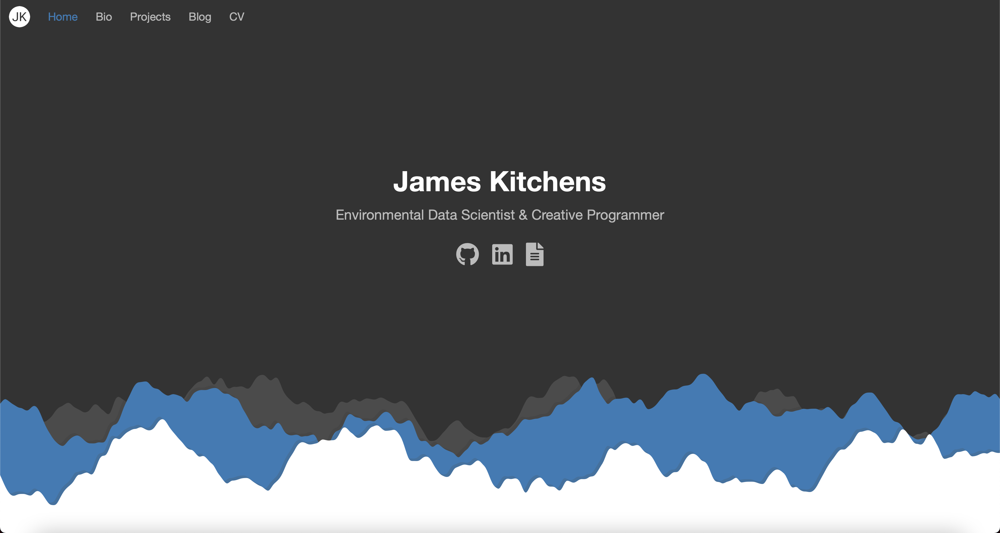

# Explorers-Portfolio-Theme

*Explorers-Portfolio-Theme is a mobile friendly theme designed for static personal porfolio websites and blogs, created with Jekyll and hosted through GitHub Pages.*

Explorers-Portfolio-Theme was first built as the template for my personal website (www.james-kitchens.com). By default, this theme includes a unique homepage with links to user's social media sites, a short biography, a section for recent research projects, and the ability to categorize blog posts.

I am always open to feedback or ways to improve this theme. Submit an [Issue](https://github.com/kitchensjn/explorers-portfolio-theme/issues/new/choose) or Pull Request with any of your ideas!

## Installation

The easiest method for installing Explorers-Portfolio-Theme is to access it through GitHub. This requires you to have an account before you can proceed; if you don't yet have one, create it [HERE](https://github.com/join). Next, follow the steps below to get you started:

### Fork This Repo

In the top right corner of this repository, click the Fork button. This will copy the repository into your account, so that you can customize it to your needs.

### Rename The Repo (Optional)

Within Settings, you can rename the repository to whatever you would like. By default, the repository name will appear within your URL (ex. [username].github.io/explorers-portfolio-theme). If you name the repository [username].github.io, you will be able to access it without the additional repository name.

### Set Up GitHub Pages

While you are in Settings, scroll down to nearly the bottom of the page and locate the GitHub Pages section. Set the Source to the 'master' branch and click Save. After a minute, refresh the page, scroll back to the GitHub Pages section, and your website's URL will be clickable.

*I am in the process of making this theme accessible through RubyGems and GitHub Pages remote_themes.*

## Usage

I've provided some default information and files from my website to fill out the theme, but you will want to make the site your own!

First, open up the _config.yml file. This contains information about you and your site. As you look into customization, information in the _config.yml will be able to be accessed throughout the various pages of your site. Information is written using YAML syntax and the formatting must be preserved. *Warning*: I highly recommend using quotes around your information as it will fail if you use special characters outside of quotes.

Next, the index.md file contains the information specifically for the homepage. "---" denotes Jekyll Front Matter, or information that can be called by name from the page. Fill out this Front Matter with your own information. Some specifics regarding formatting:

- **bio:** the "|" symbol denotes that the theme should separate paragraphs within this section
- **skills:** each row in the skills section represents a grouping of skills, which will be displayed in a line.
- **publications:** should be written in reverse chronological order. A number will be added for each publications, consistent with standard citation methods.
- **categories:** these are your post categories, currently set to projects and blog posts, but could be expanded as needed

Categories are how Explorers-Portfolio-Theme organizes the site's posts. Each category is stored in its own directory within the root directory of the site. Each category will have its own section on your homepage with each post generating an associated card in that section. The style of these cards is determine by the template set within the Front Matter of the index.md file. For an example of how to set up a post category, see either the projects or blog directory. You can write posts as a Markdown file. Front matter is specific to each category, which will be used to build the heading of each post. The written content of the post is the contained within the content of the Markdown file.

## Further Customization

If you are interested in further customization of individual elements in your site, head to the _includes directory, which contains templates for each section. The _sass directory contains stylings for every element.

## Contributing

Bug reports and pull requests are welcome on GitHub at https://github.com/kitchensjn/explorers-portfolio-theme. If you develop any animations or cards that you would like to share, you can submit them as a pull request and I will add them to the theme for others to use. This project is intended to be a safe, welcoming space for collaboration, and contributors are expected to adhere to the [Contributor Covenant](http://contributor-covenant.org) code of conduct.

## License

The theme is available as open source under the terms of the [MIT License](https://opensource.org/licenses/MIT).

